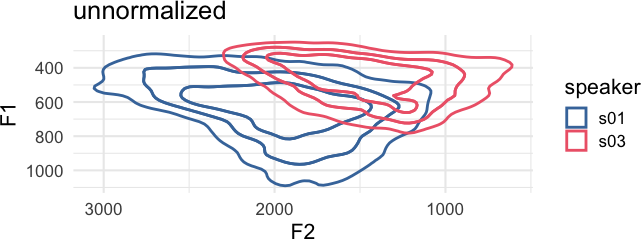
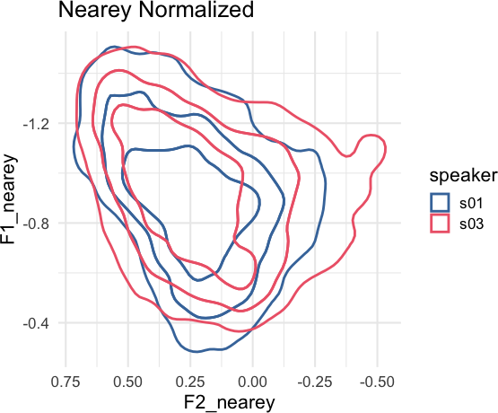
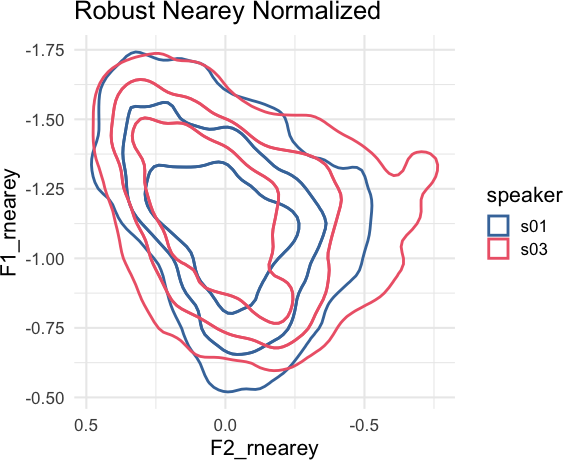

<!-- README.md is generated from README.Rmd. Please edit that file -->

# tidynorm <a href="https://jofrhwld.github.io/tidynorm/"></a>

<!-- badges: start -->

[](https://github.com/JoFrhwld/tidynorm/actions/workflows/R-CMD-check.yaml)
<!-- badges: end -->

The goal of `{tidynorm}` is to provide convenient and tidy functions to
normalize vowel formant data.

## Installation

You can install tidynorm like so

``` r
install.packages("tidynorm")
```

You can install the development version of tidynorm like so:

``` r
## if you need to install `remotes`
# install.packages("remotes")
remotes::install_github("jofrhwld/tidynorm")
```

## Example

Vowel formant frequencies are heavily influenced by vocal tract length
differences between speakers. Equivalent vowels between speakers can
have dramatically different frequency locations.

``` r
library(tidynorm)
library(ggplot2)
```

<details class="code-fold">
<summary>Plotting Options</summary>

``` r
options(
  ggplot2.discrete.colour = c(
    lapply(
      1:6,
      \(x) c(
        "#4477AA", "#EE6677", "#228833",
        "#CCBB44", "#66CCEE", "#AA3377"
      )[1:x]
    )
  ),
  ggplot2.discrete.fill = c(
    lapply(
      1:6,
      \(x) c(
        "#4477AA", "#EE6677", "#228833",
        "#CCBB44", "#66CCEE", "#AA3377"
      )[1:x]
    )
  )
)

theme_set(
  theme_minimal(
    base_size = 16
  )
)
```

</details>

<details class="code-fold">
<summary>Plotting Code</summary>

``` r
ggplot(
  speaker_data,
  aes(
    F2, F1,
    color = speaker
  )
) +
  ggdensity::stat_hdr(
    probs = c(0.95, 0.8, 0.5),
    alpha = 1,
    fill = NA,
    linewidth = 1
  ) +
  scale_x_reverse() +
  scale_y_reverse() +
  coord_fixed() +
  labs(
    title = "unnormalized"
  )
```

</details>



The goal of `{tidynorm}` is to provide tidyverse-friendly and familiar
functions that will allow you to quickly normalize vowel formant data.
There are a number of built in functions based on conventional
normalization methods.

``` r
speaker_data |>
  norm_nearey(
    F1:F3,
    .by = speaker,
    .names = "{.formant}_nearey"
  ) ->
speaker_normalized
```

    #> Normalization info
    #> • normalized with `tidynorm::norm_nearey()`
    #> • normalized `F1`, `F2`, and `F3`
    #> • normalized values in `F1_nearey`, `F2_nearey`, and `F3_nearey`
    #> • grouped by `speaker`
    #> • within formant: FALSE
    #> • (.formant - mean(.formant, na.rm = T))/(1)

<details class="code-fold">
<summary>Plotting Code</summary>

``` r
speaker_normalized |>
  ggplot(
    aes(
      F2_nearey, F1_nearey,
      color = speaker
    )
  ) +
  ggdensity::stat_hdr(
    probs = c(0.95, 0.8, 0.5),
    alpha = 1,
    fill = NA,
    linewidth = 1
  ) +
  scale_x_reverse() +
  scale_y_reverse() +
  coord_fixed() +
  labs(
    title = "Nearey Normalized"
  )
```

</details>



There is also a `tidynorm::norm_generic()` function to allow you to
define your own bespoke normalization methods. For example, a “robust
Nearey” normalization method using the median, instead of the mean,
could be done like so.

``` r
speaker_rnearey <- speaker_data |>
  norm_generic(
    F1:F3,
    .by = speaker,
    .by_formant = FALSE,
    .pre_trans = log,
    .L = median(.formant, na.rm = T),
    .names = "{.formant}_rnearey"
  )
```

    #> Normalization info
    #> • normalized with `tidynorm::norm_generic()`
    #> • normalized `F1`, `F2`, and `F3`
    #> • normalized values in `F1_rnearey`, `F2_rnearey`, and `F3_rnearey`
    #> • grouped by `speaker`
    #> • within formant: FALSE
    #> • (.formant - median(.formant, na.rm = T))/(1)

<details class="code-fold">
<summary>Plotting Code</summary>

``` r
speaker_rnearey |>
  ggplot(
    aes(
      F2_rnearey, F1_rnearey,
      color = speaker
    )
  ) +
  ggdensity::stat_hdr(
    probs = c(0.95, 0.8, 0.5),
    alpha = 1,
    fill = NA,
    linewidth = 1
  ) +
  scale_x_reverse() +
  scale_y_reverse() +
  coord_fixed() +
  labs(
    title = "Robust Nearey Normalized"
  )
```

</details>


